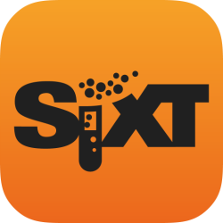

# Introduction

Micro is a microservice ecosystem. It's goal is to simplify distributed systems development. 

Technology is rapidly evolving. Cloud computing now gives us almost unlimited scale, however leveraging that scale with existing tools is still difficult. 
Micro attempts to solve this problem with a developer first focus.

At the core, micro is simple and accessible enough that anyone can easily get started writing microservices. As you scale to hundreds of services, micro 
will provide the fundamental tools required to manage a microservice environment.

## Get Started

If you want to start writing microservices go directly to the [go-micro](https://github.com/micro/go-micro) repo.

## Overview

The main piece of software provided is [Micro](https://github.com/micro/micro), a microservice toolkit.

The toolkit is composed of the following components:

- **Go Micro** - A pluggable RPC framework for writing microservices in Go. It provides libraries for 
service discovery, client side load balancing, encoding, synchronous and asynchronous communication.

- **API** - An API Gateway that serves HTTP and routes requests to appropriate micro services. 
It acts as a single entry point and can either be used as a reverse proxy or translate HTTP requests to RPC.

- **Sidecar** - A language agnostic RPC proxy with all the features of go-micro as HTTP endpoints. While Go is a great language for building microservices, 
you may also want to use other languages, so the Sidecar provides a way to integrate your other apps into the Micro world.

- **Web** - A web dashboard and reverse proxy for micro web applications. We believe that 
web apps should be built as microservices and therefore treated as a first class citizen in a microservice world. It behaves much the like the API 
reverse proxy but also includes support for web sockets.

- **CLI** - A straight forward command line interface to interact with your micro services. 
It also allows you to leverage the Sidecar as a proxy where you may not want to directly connect to the service registry.

- **Bot** - A Hubot style bot that sits inside your microservices platform and can be interacted with via Slack, HipChat, XMPP, etc. 
It provides the features of the CLI via messaging. Additional commands can be added to automate common ops tasks.
  
Note: Go-micro is a standalone library and can be used independent of the rest of the toolkit.

## Runtime

The toolkit is pluggable and runtime agnostic. Run micro on your laptop, in docker, using kubernetes, AWS and so on.

  

## Learn more

Navigate through the documentation to learn more, check out the resources below or try out some [examples](https://github.com/micro/examples).

## Resources

- Read the [blog](https://micro.mu/blog/) for a deeper look at micro and broader microservice ideas.
- Watch the [video](https://www.youtube.com/watch?v=xspaDovwk34) on Simplifying Microservices with Micro presented at Golang UK Conf 2016.
- View the [slides](https://speakerdeck.com/asim) for various presentations on speakerdeck.

## Sponsors

Open source development of Micro is sponsored by 


